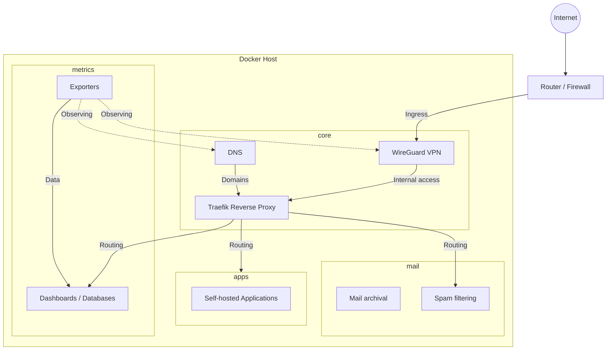

# Architecture

Rasputin runs a self-hosted infrastructure environment on a single Raspberry Pi 4B acting as the Docker host.

The environment is organized into separate Docker Compose stacks based on responsibility. Traffic, services, and shared networking are managed through these stacks to keep the deployment modular and maintainable.

## Overview

## Hardware

The complete Docker environment runs on a single Raspberry Pi 4B.

The host is responsible for:

- Running Docker and Docker Compose
- Hosting all application stacks
- Providing shared networking between services
- Executing infrastructure management commands through `homelab.sh`

The infrastructure is designed to be reproducible through configuration files and automation rather than relying on manual host configuration.

## Deployment Model

The infrastructure is defined as code:

- Docker Compose files define running services
- Templates provide generated configuration
- Encrypted environment files provide secrets
- `homelab.sh` provides the operational interface

The complete environment can be recreated from the repository contents and required secrets.

## Design Goals

The architecture prioritizes:

- **Reproducibility** — infrastructure is defined through version-controlled configuration
- **Modularity** — services are grouped into independent stacks
- **Maintainability** — common operations are handled through a single CLI
- **Isolation** — services communicate through controlled networks
- **Simplicity** — a single host keeps the environment easy to understand and operate